# Ökonomische Theorie der Nachhaltigkeit
## IPAT
$\text{Impact } = \text{ Population } \cdot \text{ Affluence } \cdot \text{ Technology } \Longrightarrow 
R = N \cdot \frac{Y}{N} \cdot \frac{R}{Y}$

Gesamtressourcenverbrauch $R =$ Bevölkerung $N$ pro-Kopf Einkommen $\frac{Y}{N}$ Ressourcenintensität des Outputs $\frac{R}{Y}$

## Solow-Modell
### Entwicklung von $y$ im Zeitverlauf
$g_y = \frac{y_1 - y_0}{y_0} \Longrightarrow y_t = e^{g_y \cdot y_0}$ (exponentieller Antieg von y)

### Neoklassische Produktionsfunktion
$Y = F(K, L) = F(K(t), L(t))$ mit 
* $L=$ Anzahl Beschäftigter (konstant)
* $Y$ = Output ($y = Y/L$ Output pro Kopf)
* $K$ = Kapital ($k = K/L$ Kapital pro Kopf)
  
| 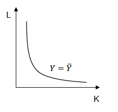|
|---|
|*Beispiel: $Y= K^\alpha L^{1-\alpha}$*|

**Kapitalstock:** Bestand an Sachkapital in einer Volkswirtschaft wie Fabrikgebäude, Maschinen oder technische Anlagen, die zu Produktionszwecken eingesetzt werden. Veränderungen des Kapitalstocks werden als Investitionen bezeichnet.

| Eigenschaften, welche Produktionsfunktion erfüllen muss|                                       
|-----------------|
| konstante Skalenerträge: $aY=F(aK,aL)$ |
|Pro-Kopf-Produktion bei konstanten Skalenerträgen: $y = \frac{Y}{L} = \frac{F(K,L)}{L}=f(k)$|
| positives Grenzprodukt des Kapitals: $f_k = \frac{df(k)}{dk} > 0 \Rightarrow$ positives GP: Anstieg von y bei Anstieg von k |
| fallendes Grenzprodukt des Kapitals: $f_{kk} = \frac{d^2f(k)}{dk^2} < 0 \Rightarrow$ fallendes GP: je höher k, desto geringer zusätzliches y, welches mit zusätzlicher Einheit von kproduziert werden kann|
|Inada-Bedingungen: $k \rightarrow 0 \Rightarrow f_k = \infty$, $k \rightarrow \infty \Rightarrow f_k = 0$ 

**Cobb-Douglas Produktionsfunktion**  
$Y= K^\alpha L^{1-\alpha}$ mit $y = \frac{Y}{L} = \frac{K^\alpha L^{1-\alpha}}{L} = \frac{K^\alpha}{L^{\alpha}} = k^\alpha$

<ins>Ersparnis pro Kopf:</ins> $sy = sf(k) = y - c$  
<ins>Konsum pro Kopf:</ins> $c = (1 - s)y=(1-s)f(k) \Longrightarrow g_c = g_y$

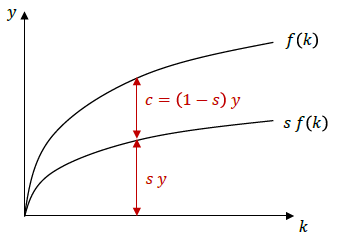

<ins>Entwicklung des Kapitalstocks:</ins> Investition = Sparen $\iff i= sy = sf(k)$ 
<ins>Abschreibungen:</ins> $\delta k$

|Kerngleichung: Änderung des Kapitalstocks (Nettoinvestitionen) = Investition - Abschreibung|
|-|
|$\Delta k = i - \delta k$|
|$\Delta k = sf(k) - \delta k$|

Wir beobachten je höher $k$, desto geringer ist allerdings der Zuwachs der Produktion $f(k)$ aus einer weiteren Erhöhung von $k \Longrightarrow$ fallendes Grenzprodukt des Kapitals
||
|-|
|$\Delta k = sf(k) - \delta k \rightarrow 0$|

|$sf(k) = \delta k$|
|-|
|es wird gerade soviel gespart/investiert, wie zum Erhalt des Kapitalstocks notwendig ist|
|Akkumulation zusätzlichen Kapitals kommt zum Stillstand ($\Delta k = 0$)|

<ins>Langfristiges Gleichgewicht erreicht: </ins>
  * $k^*$ = gleichgewichtiger Kapitalstock pro Kopf
  * $y^*$ = gleichgewichtiger Output pro Kopf 
  

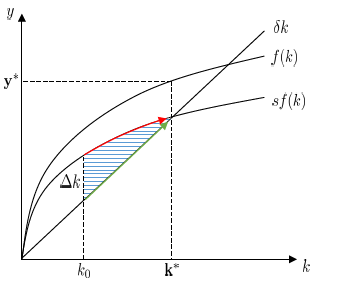

**Allgemeine Definition eines langfristiges Gleichgewichts**: alle Variablen wachsen mit konstanter Rate d.h. $g_k = \frac{y_{t + 1} - y_t}{y_t} = \frac{\Delta k_t}{k_t} =$ konstant

### **Steady State:** 
langfristigen Gleichgewicht im Solow-Modell wenn $\Delta k = 0$ und somit $g_k = 0$ und $g_y = 0$ d.h. wenn $y = y^*$ und $k = k^*$ (da wir annehmen, dass $L = c$ für $c \in \mathbb{N}$).  
$\delta k = sf(k) = sk^\alpha \iff k^{1-\alpha} = \frac{s}{\delta} \iff k^* = \frac{s}{\delta}^{\frac{1}{1 - \alpha}} \\$
$y^* = (k^*)^\alpha = \frac{s}{\delta}^{\frac{\alpha}{1 - \alpha}}$

### **Änderungen der Sparquote und der Abschreibungsrate**
Änderung der Parameter $s$ oder $\delta$ haben Auswirkung auf Kapitalstock, doch Wachstumseffekt nur während Anpassung zum neuen Gleichgewicht, Langfristig nur Niveaueffekt

### **„Arbeitssparender“ technischer Fortschritt**
Neue Produktionsfunktion: $Y = F(K, A \cdot L) = F(K(t), L(t))$ bzw. $y = f(k,A)$ mit $A$ = Arbeitsproduktivität, $A \cdot L$ = effektiver Arbeitseinsatz  
Erhöhung der Arbeitsproduktivität hat gleicher Effekt wie Erhöhung von L. Beispiel: $Y= K^\alpha (AL)^{1-\alpha}$ mit $y = A^{1 - \alpha}k^\alpha$

|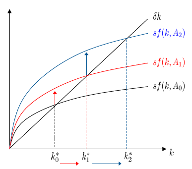|
|---|
|Anstieg der Arbeitsproduktivität im Zeitverlauf|

<ins>Beobachtung:</ins>
* Drehung der Produktionsfunktion nach oben
* gleichgewichtiger Kapitalstock steigt

<ins>Langfristiger Wachstum:</ins>
* erfordert, dass A langfristig wächst $g_A = \frac{\Delta A}{A} > 0$
* wenn $g_A$ konstant, dann gilt langfristig $g_A = g_Y = g_k$

### **Optimaler Konsum**
<ins>Definition:</ins> Optimalitätskriterium maximaler langfristiger pro-Kopf-Konsum  
$c^*$ ist maximal, wenn der Abstand zwischen $y = f(k)$ und $\delta k$ am grössten ist, dies ist genau der Fall wenn, die Steigung beider Funktionen gleich ist: $f_k(k) = \delta \Longleftarrow$ **Goldene Regel** 
$s_{max}:$ Sparquote, bei der im Gleichgewicht $c = c_{max}$

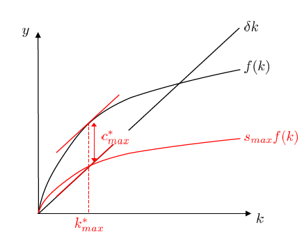 $\\$

## Ramsey-Modell
### **Intertemporaler Nutzen**
<ins>Nutzenfunktion:</ins> $U(c_t)$ = Nutzen in Periode $t$ aus Konsum in Periode $t$ mit $t \in \{1,2\} \\$
positiver, fallender Grenznutzen d.h. $U_c > 0$ und $U_{cc} < 0$ 

|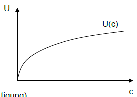|
|-|
|mehr Konsum bedeutet mehr Nutzen (Prinzip der Nicht-Sättigung)|
|allerdings: zusätzlicher Nutzen geringer, je höher Konsumniveau d.h. fallender Grenznutzen|
 
Haushalte diskontieren Nutzen aus Periode 2 mit Rate $\rho$ d.h. Periode 1 = $U(c_1)$ und Periode 2= $\frac{U(c_2)}{1 + \rho}$. Somit ist der Gesamtnutzen (Gegenwartswert des Nutzens) $\upsilon = U(c_1) + \frac{U(c_2)}{1 + \rho}\\$
Beispiel einer Nutzenfunktion: $U(c) = (1 - \gamma)^{-1}c^{1 - \gamma}$

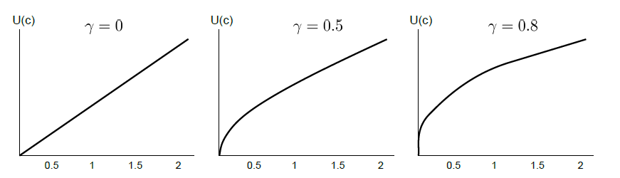

<ins>Indifferenzkurve:</ins>

|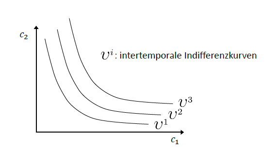|
|-|
|Steigung der Indifferenzkurven entspricht dem Verhältnis der Grenznutzen aus $c_1$ und $c_2$: $\frac{\Delta c_2}{\Delta c_1} = - \frac{\upsilon_{c_1}}{\upsilon_{c_2}}$|

### **Intertemporale Budgetrestriktion**
| | Periode 1 | Periode 2|
|-| - |-|
|Einnahmen | Arbeitseinkommen $y_1$ | Arbeitseinkommen $y_2$ und verzinste Ersparnis $(1 + r) s_1$
|Verwendung| Konsum $c_1$ und Ersparnis $s_1 = y_1 - c_1$| Konsum $c_2$|
|Budgetrestriktion in einzelner Periode| $c_1 = y_1 - s_1$ | $c_2 = y_2 + (1 + r) s_1$|
Intertemporale Budgetrestriktion|$c_2 = (1 + r)(y_1 - c_1) + y_2$|$c_2 = (1 + r)(y_1 - c_1) + y_2$|

||
|--|
|**Budgetgerade**: alle effizienten Konsumentscheide|
|Punkte unterhalb der Budgetgerade haben positive Ersparnis am Ende von Periode 2 und sind somit nicht effizient|

<ins>Nutzenmaximum:</ins> wenn Steigung der Budgetgerade = Steigung der Indifferenzkurve $1 + r = \frac{U_{c_1}}{U_{c_2}}$

||
|--|
|$\upsilon^1$: Nutzen noch steigerbar|
|$\upsilon^2$: Nutzenniveau nicht erreichbar bei gegebener Budgetrestriktion|

<ins>**Beipsiel**</ins> 

Nutzenfunktion: $U(c_t) = c_t^{1 - \gamma} \Rightarrow \upsilon =  c_1^{1 - \gamma} + \frac{c_2^{1 - \gamma}}{1 + \rho}$ 

Bedingung für Nutzenmaximum: $1 + r = \frac{c_1^{- \gamma}}{\frac{c_2^{- \gamma}}{1 + \rho}} \iff (1 + r) = (1 + \rho)(\frac{c_1}{c_2})^{-\gamma}$

Verhältnis zwischen Periode 1 und Periode 2: $(1 + \rho)(\frac{c_1}{c_2})^{-\gamma} \iff \frac{c_2}{c_1} = (\frac{1 + r}{1 + \rho})^{\frac{1}{\gamma}}$

Wachstumsrate von Konsum $c$: $g_c = \frac{\Delta c}{c} = \frac{c_2 - c_1}{c_1} = \frac{c_2}{c_1} - 1 = (\frac{1 + r}{1 + \rho})^{\frac{1}{\gamma}} - 1$

**Keynes-Ramsey Regel:** $g_c = \frac{1}{\gamma}(r - \rho)$

Herleitung:

### **Produktionsoptimum**
<ins>Gewinn:</ins> $\Pi=p_{y} F(K, L)-r K-w L-\delta K$ mit $p_y =$ Preis von $y$ (zur Vereinfachung $p_y = 1$) und $w$ = Lohnsatz

<ins>Bedingungen für Gewinnmaximum:</ins> 
* $\frac{\partial \Pi}{\partial K}=0 \quad \Rightarrow \quad r=F_{K}-\delta \quad \Leftrightarrow \quad r=f_{k}-\delta$
* $\frac{\partial \Pi}{\partial L}=0 \quad \Rightarrow \quad w=F_{L}$

### **Langfristiges Gleichgewicht**
Haushalte: $g_{C}=\frac{1}{\gamma}(r-\rho)$  
Unternehmen: $r=f_{k}-\delta$  
Simultanes Optimum: $g_{C}=\frac{1}{\gamma}(f_{k}-\delta-\rho)\\$
Dynamik des Kapitalstocks: $\Delta k = \dot{k}=\frac{d k}{d t}=f(k)-c-\delta k$ 

Da $L$ konstant gilt $g_Y = g_K$. Aufgrund des abnehmenden Grenzprodukts des Kapitals wächst die Wirtschaft langfristig nicht.

$\dot{c}=0 \quad \Leftrightarrow \quad \rho=f_{k}-\delta = r \quad$ folgt aus $g_{C}=\frac{1}{\gamma}(f_{k}-\delta-\rho)$ und $r=f_{k}-\delta$ 
Es gilt also $g_c = 0$ wenn das Grenzprodukt des Kapitals ( = Zinssatz) gerade der Diskontrate entspricht, d.h. Haushalte indifferent zwischen Konsum heute und Konsum in der Zukunft

$\dot{k}=0 \quad \Leftrightarrow \quad c=f(k)-\delta k\quad$ folgt aus $g_{K}=\frac{f(k)-c}{k}-\delta$  
Es gilt also $g_K = 0$, wenn der Output, der nicht für Erhalt des Kapitalstocks verwendet wird, konsumiert wird.

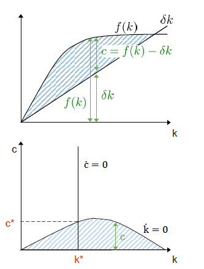

### **Vergleich mit Optimum im Solow Modell**
* optimaler Kapitalstock Ramsey-Modell: $f_k(k^*_{R}) = \rho + \delta$
* optimaler Konsum Solow-Modell: $f_k(k^*_{S}) = \delta$
  
Es folgt: $f_k(k^*_{R}) > f_k(k^*_{S}) \Longleftrightarrow k^*_{S} > k^*_{R}$, da $f_{kk} < 0$. Die Intuition dahinter ist,
Haushalte sparen im Ramsey-Modell weniger aufgrund der Ungeduld der Haushalte.

### **Alternative Modellierung der Produktionstechnologie**
<ins>Solow-Modell:</ins> $g_{k}=s \frac{f(k)}{k}-\delta=s \frac{A k}{k}-\delta$ d.h. langfristiges Wachstum positiv, wenn Einsatz von Kapital ausreichend produktiv, d.h. wenn $sA > \delta$.

<ins>Ramsey-Modell:</ins> $g_{c}=\frac{1}{\gamma}\left(f_{k}-\delta-\rho\right)=\frac{1}{\gamma}(A-\delta-\rho)$ d.h. langfristiges Wachstum ebenfalls positiv, wenn Einsatz von Kapital ausreichend produktiv, d.h. wenn $A - \rho > \delta$

## Hotelling-Regel
**Wachstumsrate der Ressourcen-Rente $(g_{p_R}^n)=$ Zinssatz $(r)$** 

wobei Ressourcen-Rente $\left(p_{R}^{n}\right)=$ Preis der Ressource $\left(p^{R}\right)-$ marginale Extraktionskosten $\left(c^{R}\right)$. Ressourcen-Rente steigt im Zeitablauf mit dem Zinssatz.

Im **Gleichgewicht** wenn die Verzinsung der Anlage des Gewinns aus dem Verkauf der abgebauten Ressource  $(p_{R}^n)$ auf dem Kapitalmarkt, der Verzinsung bei Anlage in alternative Vermögensformen $(W_t)$ entsprechen:   $p_{R 1}^{n}(1+r)=p_{R 2}^{n}$ äquivalent zu: $W_{1}^{R}(1+r)=W_{2}^{R}$ woruas folgt 
$\frac{p_{R 2}^{n}}{p_{R 1}^{n}}=1+r \quad \Longleftrightarrow \quad \frac{p_{R 2}^{n}-p_{R 1}^{n}}{p_{R 1}^{n}}=g_{p_{R}^{n}}=r \Longrightarrow p_{R t}^{n}=p_{R 0}^{n} e^{r * t}$ wenn Periodenlönge gegen Null

**Horelling Pfad**
|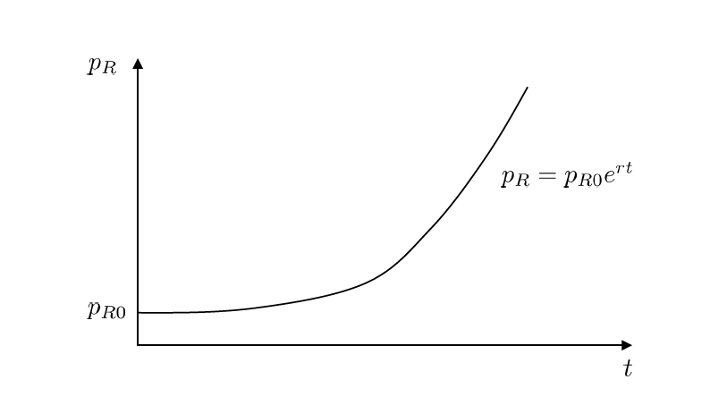|
|-|
|*mit $c^R = 0 \Rightarrow$ und Ressourcenrente entspricht Preis der Ressource: $p_R^n = p_R$*|
||

### **Nachfrage nach Ressource R**
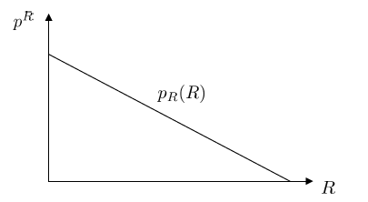

### **Resourcenextraktionspfad**
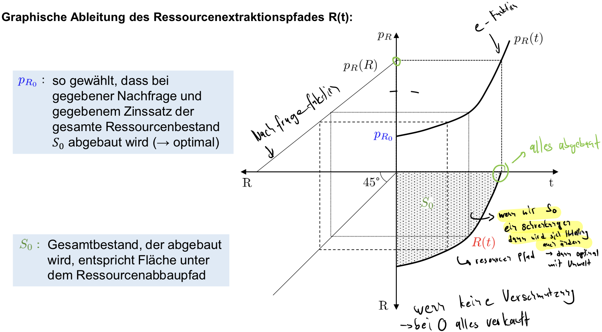

### Veränderung des Resourcenextraktionspfades
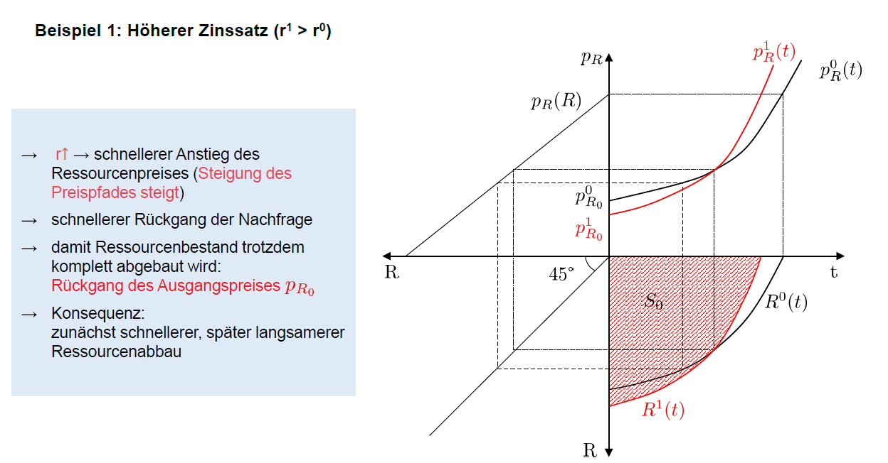

### **Hartwick-Regel**
Einsatz der Ressource sinkt im Zeitablauf und muss somit durch Kapital substituiert werden.

### **Produktionsfunktion mit nicht-erneuerbaren Ressourcen (d.h. mit $\sigma = 1$)**

$Y=F(K, R)=K^{\alpha} R^{1-\alpha}$ mit $0<\alpha<1$

<ins>Wachstumsrate des Outputs:</ins> $g_{Y}=\alpha g_{K}+(1-\alpha) g_{R}=g_{K}+(1-\alpha)\left(g_{R}-g_{K}\right)$ mit $g_R < 0$, das wir immer weniger Ressourcen einsetzen  
<ins>Entwicklung des Kapitalstocks:</ins> $\dot{K}=s Y \Leftrightarrow g_{K}=\frac{\dot{K}}{K}=s \frac{Y}{K}\\$
<ins>Konsum:</ins> $C = (1-s)Y \Rightarrow g_Y = g_C\\$
<ins>Gewinnmaximierung der Unternehmen:</ins> $\max \Pi=y-r K-p_{R} R=K^{\alpha} R^{1-\alpha}-r K-p_{R} R\\$
<ins>Optimaler Ressourceneinsatz:</ins> $\frac{\partial \Pi}{\partial R}=0 \quad \Leftrightarrow \quad p_{R}=\frac{\partial Y}{\partial R}=(1-\alpha) K^{\alpha} R^{-\alpha}=(1-\alpha)\left(\frac{K}{R}\right)^{\alpha}$
es muss also gelten Ressourcenpreis = Grenzprodukt des Ressourceneinsatzes, 
aus $p_{R}=(1-\alpha)\left(\frac{K}{R}\right)^{\alpha}$ folgt: $\quad g_{p_{R}}=\alpha\left(g_{K}-g_{R}\right)$ 
<ins>Optimaler Kapitaleinsatz:</ins> $\frac{\partial \Pi}{\partial K}=0 \quad \Leftrightarrow \quad r=\frac{\partial Y}{\partial K}=\alpha K^{\alpha-1} R^{1-\alpha}=\alpha \frac{Y}{K}$ Zinssatz = Grenzprodukt des Kapitals 

aus Hotelling-Regel (Wachstumsrate des Ressourcenpreises = Zinssatz) folgt: $\quad \alpha\left(g_{K}-g_{R}\right) = \alpha \frac{Y}{K} \Leftrightarrow  g_{K}-g_{R} =\frac{Y}{K}$

Einsetzen in Wachstumsrate von $Y$: 
$g_{Y} =g_{K}-(1-\alpha)\left(g_{K}-g_{R}\right) =s \frac{Y}{K}-(1-\alpha) \frac{Y}{K} =(s-(1-\alpha)) \frac{Y}{K}\\$ 
Nachhaltigkeit, d.h. konstantes Einkommen/Konsum $(g_Y = 0)$, wenn $s = 1 - \alpha$ (Hartwick-Regel)

### **Produktionsfunktion mit technischer Fortschritt**
<ins>Produktionsfunktion:</ins> $Y=K^{\alpha}(A R)^{1-\alpha}\\$
<ins>Wachstumsrate des Outputs:</ins> $\quad g_{Y} =\alpha g_{K}+(1-\alpha)\left(g_{A}+g_{R}\right) =g_{K}+(1-\alpha)\left(g_{A}+g_{R}-g_{K}\right) = (s-(1-\alpha)) \frac{Y}{K}+(1-\alpha) g_{A}\\$
Aus dieser Wachstumsrate folgt, dass wenn Erträge aus Ressourcenabbau vollständig reinvestiert werden
d.h. $s = 1 - \alpha$, ist langfristiges Wachstum möglich

### **Ramsey-Modell mit erschöpfbaren Ressourcen**
Unternehmen: $r = F_K$  
Haushalte: $g_{C}=\frac{1}{\gamma}(r-\rho) \quad \Leftrightarrow \quad g_{C}=\frac{1}{\gamma}\left(F_{K}-\rho\right) \quad \Leftrightarrow \quad g_{C}=\frac{1}{\gamma}\left(\alpha\left(\frac{R}{K}\right)^{1-\alpha}-\rho\right)$. 

Somit ist ein langfristig konstantes Konsumniveau 
abhängig von Entwicklung des Grenzproduktes des Kapitals $\alpha\left(\frac{R}{K}\right)^{1-\alpha}$  d.h. abhängig von Entwicklung von $R$ und $K$.

## Erneuerbaren Ressourcen
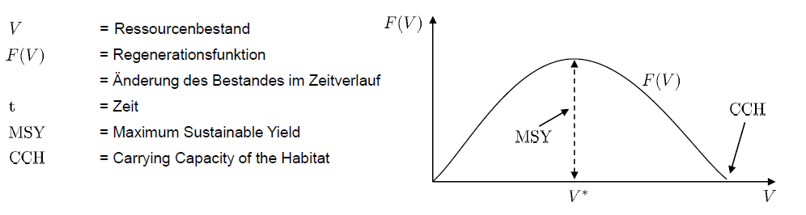

$V_{t}=\frac{\mathrm{CCH}}{\left(1+\frac{\mathrm{CCH}-V_{0}}{V_{0}} e^{-k t}\right)} \quad \Rightarrow \quad F\left(V_{t}\right)=\frac{d V_{t}}{d t}=k V_{t}\left(1-\frac{V_{t}}{\mathrm{CCH}}\right)$ mit $V_{0}=$ Anfangsbestand $k=$ intrinsische Wachstumsrate

**Alternative Regenerationsfunktionen** mit Schwellenwert $V_{min}$ (Ausrottung unterhalb des
Schwellenwertes):

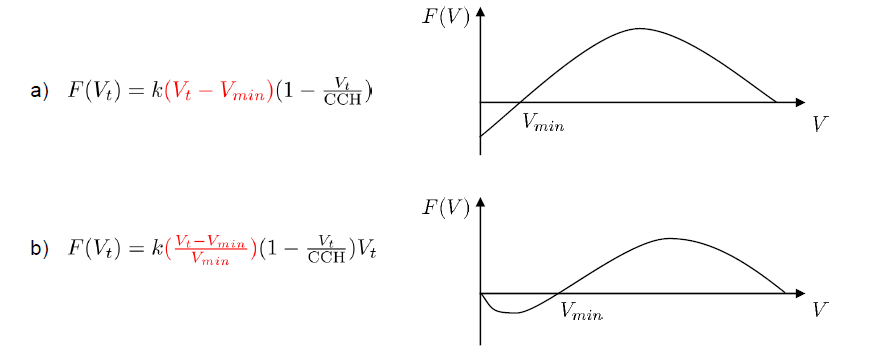

<ins>Entwicklung des Bestandes:</ins> $\dot{V} = F(V) - Z$ wobei $Z$ = Ernte

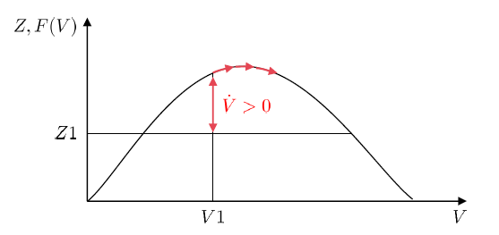

Gleichgewicht dann erreicht, wenn keine Änderung des Bestandes im Zeitverlauf: $\dot{V} = 0 \iff F(V) = Z$.  
Gleichgewicht entspricht der Bedingung für starke Nachhaltigkeit, offensichtlich gibt es immer zwei möglich Punkte wenn $Z \neq V_{MSY}$.
### **Stabilität von Gleichgewichten**
Stabil, wenn sich das System über die Zeit auf ein Gleichgewicht zu bewegt. 
**Beispiel:**

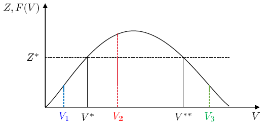  
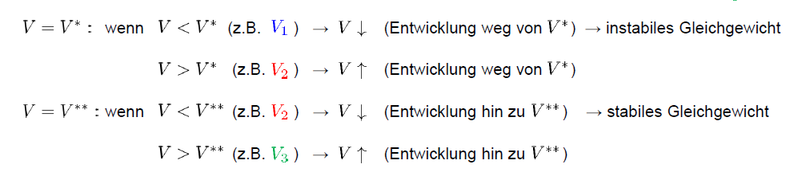

### **Statisches Optimum**
<ins>Gewinn:</ins> $\Pi = R(Z) - C(Z,V)$ mit $R(Z)$ = Ernteerlös und $C(Z,V)$ Ernekosten  
<ins>Ernteerlös:</ins> $R(Z)= p \cdot Z\\$
<ins>Erntekosten:</ins> $C_Z > 0, C_{ZZ} > 0 \Longrightarrow$ Kosten steigen bei Erhöhung der Ernte  

|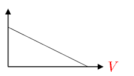|
|---|
|$C_V < 0 \Longrightarrow$ Kosten niedriger bei höherem Bestand überproportional|

Bedingung für (statisches) ökonomisches Gleichgewicht (Bedingung für Gewinnmaximum): $\Pi_{Z}=0 \Leftrightarrow p=C_{Z} \quad$ (Preis = Grenzkosten)

**Simultanes ökonomisches und biologisches Gleichgewicht:**

### **Intertemporales Optimum**

1. Verzicht auf Zinsertrag: $r \cdot p^n$
2. Kosten/Nutzen bei Änderung von $p^n$: höherer Nettoerlös aus Verkauf wenn $\dot{p}^n = \frac{dp^n}{dt} > 0$ (kann auch geringer sein d.h. $\frac{dp^n}{dt} < 0$)
3. Durch Verzicht auf Ernte kommt Anstieg des Bestandes, so dass
   1. Rückwirkung auf bestandsabhängige Kosten (bei höherem Bestand geringer): eingesparte Kosten $= -C_V = -\frac{dC(V)}{dV} > 0$
   2. Rückwirkung auf bestandsabhängige Kosten (bei höherem Bestand geringer): zusätzlicher Verkaufserlös $p^n F_V > 0$ oder geringer Verkaufserlös $p^n F_V < 0$

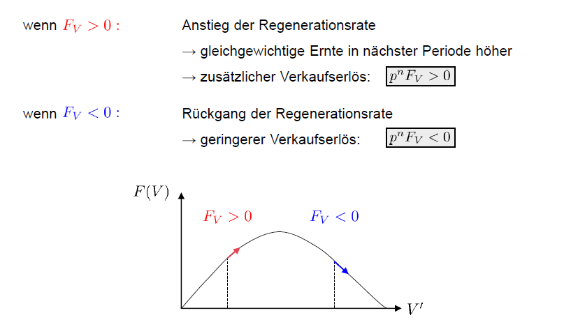

* **verzicht** auf Ernte, wenn die zusätzlichen Erträge aus der Verschiebung der Ernte höher
sind als die zusätzlichen Kosten, d.h. wenn $r \cdot p_{R}^{n}<\dot{p}^{n}-C_{V}+p^{n} F_{V}$
* Unternehmer **erhöht** Ernte, wenn $r \cdot p^{n}>\dot{p}^{n}-C_{V}+p^{n} F_{V}$
* **Gleichgewicht** : $r \cdot p^{n}=\dot{p}^{n}-C_{V}+p^{n} F_{V}$ , was die Bedingung für optimales intertemporales ökonomisches Gleichgewichts ist 

### **Bedingungen für optimales intertemporales bio-ökonomisches Gleichgewicht**
1. $F_{V}=r-\frac{\dot{p}^{n}}{p^{n}}+\frac{C_{V}}{p^{n}}$ (intertemp. ökon. Gleichgewicht)
2. $F(V)=Z$ (biologisches Gleichgewicht)

### **Open-Access**
<ins>Gleichgewicht:</ins> Gewinn jedes Anbieters ist gerade gleich Null, d.h. 
Erntekosten = Ernteerlös: $C(Z,V) = p \cdot Z$  
1. $F(V)=Z$ (biologisches Gleichgewicht) 
2. Ökonomisches Gleichgewicht: $C(V) = p \cdot Z$ (vereinfachende Annahme: $C(Z,V) = C(V)$, d.h. keine ernteabhängigen Kosten)
   
$\Longrightarrow$  Simultanes Gleichgewicht: $C(V) = p \cdot F(V)$

|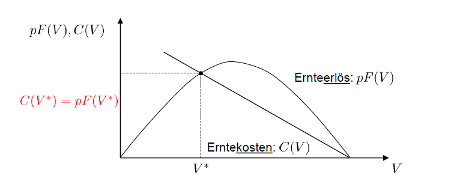|
|-|
|$V^*$(stabiles) Marktgleichgewicht: keine zusätzlichen Markteintritte, keine austritte|

### **Vergleich mit Gleichgewicht bei privatem Eigentum an Ressource**
<ins>Privateigentum Maximierung des Gewinns:</ins> $\Pi = p \cdot Z - C(V) = p \cdot F(V) - C(V)$ ergibt
$p \cdot F_V = C_V < 0$

## Hartwick Regel für erneuerbare Ressourcen
<ins>Produktionsfunktion:</ins> $Y= K^\alpha Z^{1-\alpha}$  
1. Wachstumsrate des Outputs: $g_{Y}=\alpha g_{K}+(1-\alpha) g_{Z}$
2. Entwicklung des Kapitalstocks: $g_{K}=\frac{\dot{K}}{K}=s \frac{Y}{K}$
3. $g_{p}=\alpha\left(g_{K}-g_{Z}\right)$
4. $r = \alpha \frac{Y}{K}$

<ins>Entwicklung des Ressourcenbestandes über die Zeit:</ins> $\dot{V} = F(V) - Z$

<ins>nachhaltige Ernte:</ins>
$\dot{V}=0 \quad \Leftrightarrow \quad g_{Z}=0 \quad \Leftrightarrow \quad F(V)=Z \Longrightarrow$
über die Zeit konstanter Ressourceneinsatz möglich, solange Ernte = Regeneration 

5. Hotelling Regel für erneuerbare Ressourcen: $r = g_p + F_V$ (unter Annahme $C(Z,V) = 0$)
6. aus 2,3,4 und 5 für $g_Z = 0$ folgt $F_V = \alpha(1-s)\frac{Y}{K}$, sowie $g_Y = \alpha s \frac{Y}{K}$
Produktion (und damit Konsum) und Kapitalstock im Zeitverlauf konstant , wenn Sparquote gleich Null

Intuition: Wenn der Ressourceneinsatz über die Zeit konstant ist, dann ist eine konstante
Produktion möglich, sofern der Kapitalstock ebenfalls über die Zeit konstant ist
* keine Investition/Ersparnis notwendig
* wenn positive Ersparnis, dann auch steigende Produktion möglich
 

<ins>Berücksichtigung von Abschreibungen:</ins> $g_K = s\frac{Y}{K} - \delta$

aus Hotelling-Regel folgt dann $F_V = (1 - s) \alpha \frac{Y}{K} + \alpha \delta$  
konstanter Output erfordert bei $g_z = 0$ : $g_Y = \alpha (s\frac{Y}{K} - \delta) = 0 \Longrightarrow s = \frac{K}{Y}\delta$

**Intuition**: positive Ersparnis, um Abschreibungen zu kompensieren und Kapitalstock konstant zu
halten  
Regenerationsrate bei $s=\frac{K}{Y} \delta: \quad F_{V}=\left(1-\frac{K}{Y} \delta\right) \alpha \frac{Y}{K}-\alpha \delta \Rightarrow F_{V}=\alpha \frac{Y}{K}=r$

### **Konsumentwicklung bei zinsabhängigem Sparen**
Haushalte: maximieren intertemporalen Nutzen d.h.
* Keynes Ramsey Regel: $g_{C}=\frac{1}{\gamma}(r-\rho)$
* Konsum konstant, wenn $r = \rho$

## **Umweltverschmutzung und Environmental Kuznets Curve**
### **Marktgleichgewicht**

|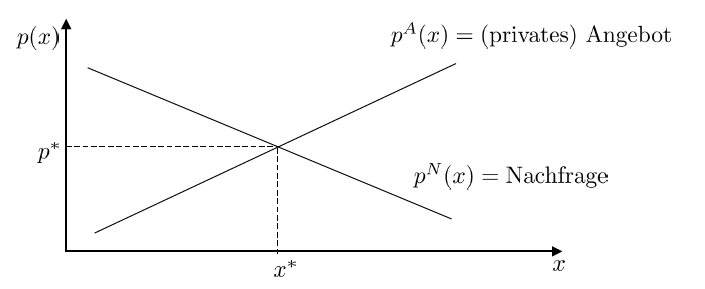|
|--|
|**Angebot**: reflektiert privateKosten, die Produzenten bei der Produktion einer weiteren (marginalen) Einheit des Guts entstehen|
|**Nachfrage**: reflektiert Nutzen, der Konsumenten aus einer weiteren (marginalen) Einheit des Gutes (=Zahlungsbereitschaft)|
|**Marktgleichgewicht**: Angebot = Nachfrage $\Longleftrightarrow$ Nutzen aus weiterer Einheit von x = Kosten für die Produktion einer weiteren Einheit von x|

### **Sozial optimale Produktion des Gutes**
Berücksichtigt die externe Effekte.

|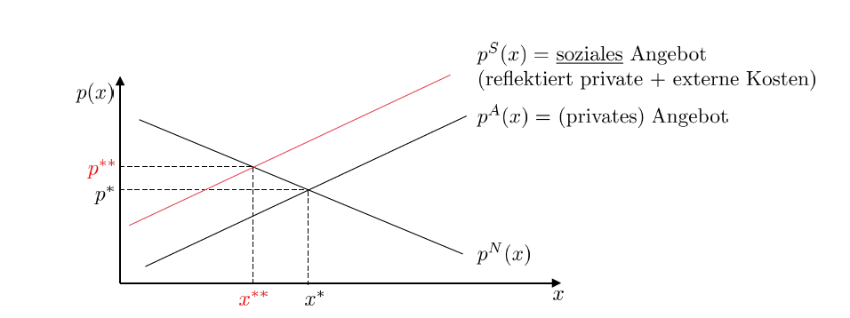|
|---|
|Produktionsmenge zu hoch $(x^* > x^**)$ wenn externer Effekt nichtberücksichtigt|
|Preis zu niedrig $(p^* < p^**)$ wenn externer Effekt nichtberücksichtigt|

<ins>**Wohlfahrtsverlust**</ins>

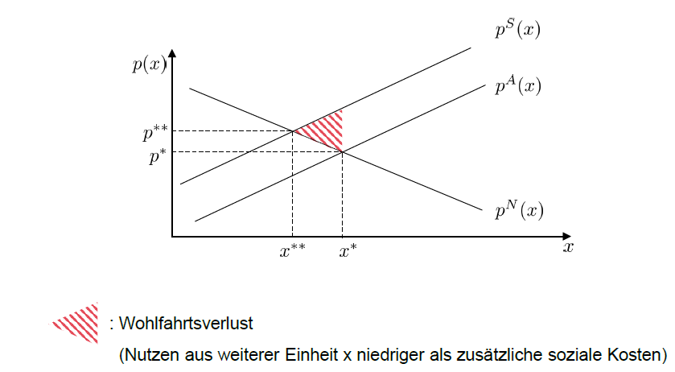  
Umweltkosten auf 0 zu reduzieren ist praktisch unmöglisch, darum nützt ein Verbot nur dann, wenn
auch Nachfrage sehr tief ist.

<ins>**Internalisierung eines negativen externen Effektes durch Ökosteuer** </ins>

||
|----|
|Produzenten müssen pro produzierter Einheit Steuer in Höhe von $t$ zahlen|
|Steuersatz optimal, der im Gleichgewicht sozial-optimale Preis-Mengen-Kombination generiert $\Longrightarrow$ optimaler Steuersatz = externe Grenzkosten|

### **Ökologische Treffsicherheit**

|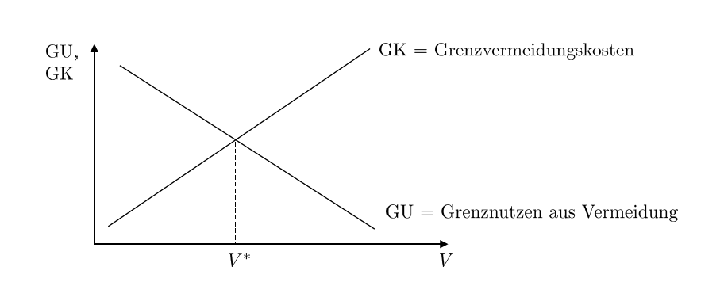|
|---|
|$V^*=$ Vermeidungsniveaus|
|*Bemerkung: GU ist das, was wir wieder zurück erhalten.*|
|Im Optimum: Grenzvermeidungskosten (GK) = Grenznutzen aus Vermeidung (GU)|

### **Kosteneffizienz**

<ins>Ziel:</ins> Erreichung des Vermeidungsziels zu geringstmöglichen Kosten, was 
dann erreicht ist, wenn Grenzvermeidungskosten aller Firmen gleich sind.

### **Gesamtkosten der Vermeidung**
  
$\Longrightarrow$ da schraffierte Fläche grösser als nicht schraffierte Fläche sparen wir Kosten (d.h. wir haben ein Ersparnis), was besser für die Wirschaft ist. Anpassung der Vermeidung der Unternehmen führt solange zu Verringerung der gesamtwirtschaftlichen Kosten, solange Grenzvermeidungskosten der Unternehmen unterschiedlich

## **Verlangsamung des Wachstums /Verminderung des gleichgewichtigen Kapitalstocks**

Umweltverschmutzung $P$ beeinträchtigt Produktion: $Y = K^{\alpha}L^{1 - \alpha}P^{- \beta}$  
Umweltverschmutzung als Nebenprodukt des Kapitaleinsatzes: $P = aK$

<ins>Konsequenzen</ins>

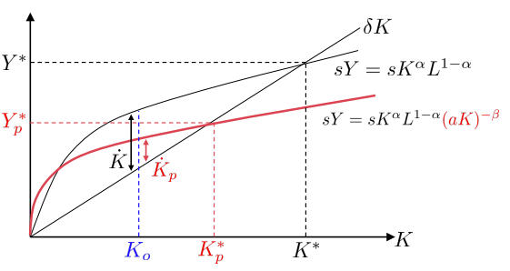

1. Geringerer gleichgewichtiger Kapitalstock und geringere Produktion $K_p^* < K^*, Y_p^* < Y^*$
2. Langsameres Wachstum während
Anpassung zum Gleichgewicht $\dot{K}_p < \dot{K}$

### **Berücksichtigung von Vermeidungsaktivitäten**
- Verwendung eines Teils von $K$ für Vermeidungsaktivitäten $(v_1 \cdot K)$
- Einsatz von induziert Rückgang der Verschmutzung in Höhe von $v_2 \cdot K$ reduzierte Nettoverschmutzung: $P_{N}=P-v_{2} K$
- Kapitalakkumulation: $\dot{K}=s Y-\left(v_{1}+\delta\right) K$
- Produktion bei Vermeidung: $Y=K^{\alpha} L^{1-\alpha}\left[\left(a-v_{2}\right) K\right]^{-\beta}$

||
|---|
|gleichgewichtiger Kapitalstock kann fallen oder sinken|
|expansiver Effekt: höhere Produktivität|
|kontraktiver Effekt: geringere Nettoersparnis und damit geringe Nettoinvestition|

### **Rolle des technischen Fortschritts**

### **Klimawandel**
Es gilt $d P / d t=\Theta R-\zeta P$ mit  P = Bestand an Treibhausgasen, R = Verbrauch nicht erneuerbarer Ressourcen, $\Theta$ = Verschmutzungsintensität, $\zeta$ = natürliche Zerfallsrate und S =  Bestand an nicht-erneuerbaren Ressourcen. Mit $\zeta = 0$ gilt $P_t = \Theta(S_0 - S_t)$.

Wir sehen dass $\delta = \delta(P)$ jetzt klimabedingt ist und wir Zusatzabschreibungen, wodurch der Wachstumsprozess früher aufhört.

### **Neue Wachstumstheorie**

$g_c =\frac{1}{\gamma}(A - \delta(P)-\rho)$
- Wachstum wird durch Klimawandel verringert und ist positiv, wenn gilt $A > \delta(P) + \rho$
- stark gefährdete Regionen ist $\delta(P)$ hoch
- in entwickelten Länder: $A$ hoch und $\rho$ tief. In anderen meist ungekehrt $\Longrightarrow$ Prozess der Divergenz der weltweiten Entwicklung durch Klimawandel

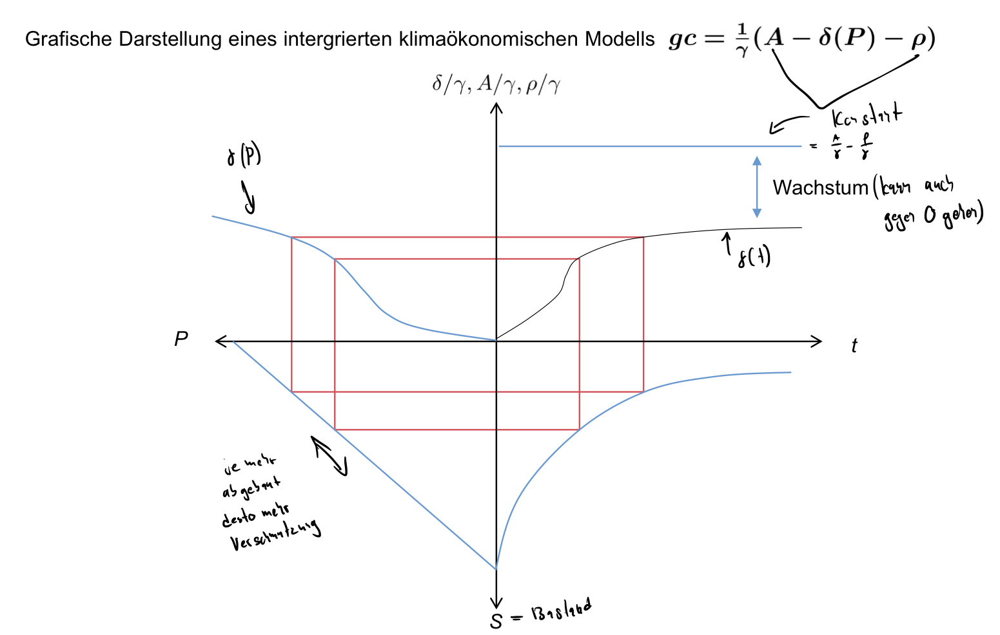

### **Environmental Kuznets Curve**

<ins>Schätzung der funktionalen Form des Einkommens-Verschmutzungs-Zusammenhangs</ins>

||
|--|
|$\alpha=$ einkommensunabhängige Verschmutzung|
|$\beta=$ relative Bedeutung der jeweiligen erklärenden Variablen|
|$e_i=$ Fehlerterm|
|empirischen Zusammenhang am Besten widerspiegelt von mittlere Kurve|

**<ins>Schätzergebnisse</ins>**

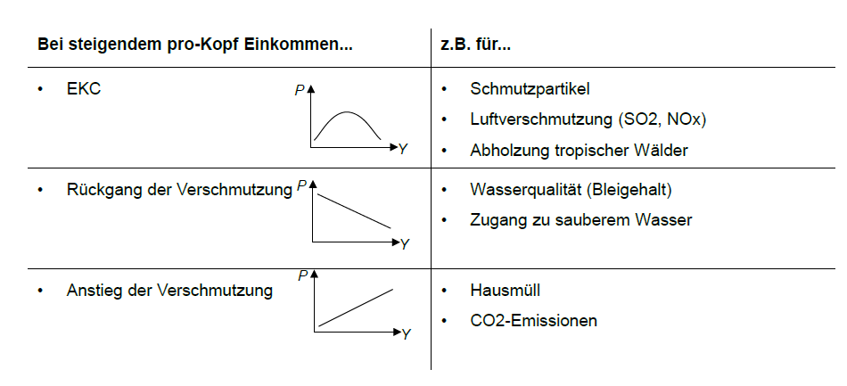